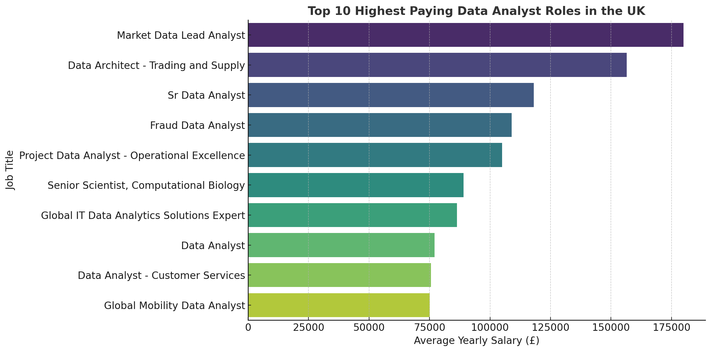

# Introduction
This project dives deep into the top-paying Data Analyst roles in the United Kingdom 🇬🇧, identifying the most in-demand skills 🧠 and trends 📈 in the field. It highlights the highest-paying opportunities 💼, focusing on where high demand meets high salary 💵. It’s designed to provide insights for both job seekers and professionals looking to optimize their career paths in data analytics. 

Want to check out SQL queries? You can find them here: [project_sql](/project_sql/) 🔍.

# Background

Driven by a passion for understanding the evolving data analyst job market, this project was created to uncover the most valuable insights around top-paying roles and in-demand skills 💼💡. The goal was to simplify the job search process by identifying what truly matters — the skills and roles that offer both high demand and strong financial rewards 💵.

The data used for this project comes includes information on job titles, salaries, locations, and required skills. Through SQL queries, this analysis delivers a practical look at where opportunity meets reward in data analytics.

### The questions I wanted to answer through my SQL queries were:

1. What are the top paying data analyst jobs?
2. What skills are required for these top paying jobs?
3. What skills are most in demand for data analyst?
4. Which skills are associated with higher salaries?
5. What are the most optimal skills to learn?
 

# Tools I USed

For my deep dive into the Data Analyst job market, I harnessed the power of several key tools to extract, analyze, and present meaningful insights:

- **SQL** – The backbone of the analysis, used to query data and extract critical insights 📊

- **PostgreSQL** – A robust database management system, perfect for handling and organizing job posting data 🗃️

- **Visual Studio Code** – My primary workspace for writing and running SQL queries efficiently 💻

- **Git & GitHub** – Used for version control and sharing SQL scripts, ensuring seamless collaboration and project tracking 🔄


# The Analysis

Each SQL query in this project was crafted to explore specific aspects of the Data Analyst job market. Here's how I approached each question:

### 1. Top Paying Data Analyst Jobs
To identify the highest-paying roles, I filtered job postings for data analyst positions with specified annual salaries (excluding nulls). I focused on jobs based in the United Kingdom and included remote opportunities. This query helped surface the top 10 highest-paying roles, offering insight into where the best financial opportunities lie.

```sql
SELECT
    job_id,
    job_title,
    job_location,
    job_schedule_type,
    salary_year_avg,
    job_posted_date,
    name AS company_name
FROM 
    job_postings_fact
LEFT JOIN company_dim ON job_postings_fact.company_id = company_dim.company_id
WHERE
    job_location = 'United Kingdom' AND 
    job_title_short = 'Data Analyst' AND
    salary_year_avg IS NOT NULL
ORDER BY salary_year_avg DESC
LIMIT 10

```
Here is a summary of the top 10 highest-paying Data Analyst jobs in the United Kingdom:

- The highest salary was £180,000, offered by Deutsche Bank for a senior role.
- Most of the top-paying jobs are in the finance and energy industries.
- Job titles such as "Lead Analyst", "Senior Analyst", and "Data Architect" tend to offer higher salaries.
- Specialised roles, such as those focused on fraud, trading, or biology, are paid more.
- The salaries range from around £75,000 to £180,000 per year.

 
 


### 2. Skills for Top Paying Jobs

To uncover the skills that employers prioritize for the highest-paying Data Analyst roles, I performed a SQL join between the top job postings and their associated skill sets. This allowed me to identify the tools and technologies most commonly required in roles with high compensation. The findings provide valuable insights for job seekers aiming to align their skill development with top-paying opportunities.

```sql
WITH top_paying_jobs AS (
    SELECT
        job_postings_fact.job_id,
        job_title,
        salary_year_avg,
        name AS company_name
    FROM 
        job_postings_fact
    LEFT JOIN company_dim ON job_postings_fact.company_id = company_dim.company_id
    WHERE
        job_location = 'United Kingdom' AND 
        job_title_short = 'Data Analyst' AND
        salary_year_avg IS NOT NULL
    ORDER BY salary_year_avg DESC
    LIMIT 10
)

SELECT 
    top_paying_jobs.*,
    skills
FROM top_paying_jobs
INNER JOIN skills_job_dim ON top_paying_jobs.job_id = skills_job_dim.job_id
INNER JOIN skills_dim ON skills_job_dim.skill_id = skills_dim.skill_id
ORDER BY salary_year_avg DESC
```
Here's the breakdown of skills required for top-paying Data Analyst roles in the UK:
- The most commonly required skill is Excel, showing it's still important even in high-paying roles.
- Other popular skills include SQL, Python, Power BI and Tableau and Jupyter
- Some specialized roles (like at Shell) also mention tools like Shell, Flow, and Express, which are more technical.

### 3. Most Demanding Skills

This query highlighted the most demanding skills across top-paying job postings, helping prioritize areas of high employer interest.

```sql
SELECT 
    skills,
    COUNT(skills_job_dim.job_id) AS demand_count
FROM job_postings_fact
INNER JOIN skills_job_dim ON job_postings_fact.job_id = skills_job_dim.job_id
INNER JOIN skills_dim ON skills_job_dim.skill_id = skills_dim.skill_id
WHERE
    job_location = 'United Kingdom' AND
    job_title_short = 'Data Analyst' AND
    salary_year_avg IS NOT NULL
GROUP BY skills
ORDER BY demand_count DESC
LIMIT 5
```

According to the analysis of top-paying job listings:
- Excel is the most in-demand skill, appearing in 11 listings. It’s still essential for handling and analyzing data.
- SQL and Python are also highly sought after, each appearing in 8 listings. These are key for working with databases and automating analysis.
- Tableau and Power BI, both used for creating data visualizations and dashboards, appeared 5 and 3 times, respectively.
- In short, Excel, SQL, and Python are the core skills to focus on if you're aiming for a high-paying Data Analyst job in the UK.


| Skill    | Demand Count |
| -------- | ------------ |
| Excel    | 11           |
| Python   | 8            |
| Tableau  | 5            |
| Power BI | 3            |


### 4. Skills Based on Salary

Analyzing the average salaries linked to various skills helped identify which ones are associated with the highest pay.

```sql 
SELECT 
    skills,
    ROUND(AVG(salary_year_avg),0) AS avg_salary
FROM job_postings_fact
INNER JOIN skills_job_dim ON job_postings_fact.job_id = skills_job_dim.job_id
LEFT JOIN skills_dim ON skills_job_dim.skill_id = skills_dim.skill_id
WHERE 
    job_title_short = 'Data Analyst' AND
    salary_year_avg IS NOT NULL AND
    job_location = 'United Kingdom'
GROUP BY 
    skills
ORDER BY 
    avg_salary
LIMIT 25
```
Exploring the relationship between different skills and job salaries reveals:

- Top-Paying Skills are often technical and include tools used in programming, data analysis, and cloud platforms—like Jupyter, Git, Databricks, Azure, and Express.

- Widely Used and Valuable Skills like Python, Excel, R, and Tableau are also linked to strong earning potential and are common in data-focused roles.

- Moderately Valued Skills such as Power BI, Notion, TypeScript, and VBA are useful in reporting, automation, and business intelligence, with decent salary outcomes.

- Lower-Paying Skills tend to be general office tools like PowerPoint, Word, and Outlook, which are more common in administrative or support roles.

#### Top Paying Skills and Their Average Salary

| **Skill**  | **Average Salary** |
| ---------- | ------------------ |
| Express    | £104,757           |
| Jupyter    | £103,620           |
| Git        | £89,100            |
| Unify      | £89,100            |
| Databricks | £86,400            |
| Azure      | £86,400            |
| SAP        | £86,400            |

### 5. Most Optimal Skills To Learn

By combining insights from demand and salary data, this query aimed to identify skills that are both highly sought after and offer high salaries, providing a strategic focus for skill development.

```sql
SELECT 
    skills_dim.skill_id,
    skills_dim.skills,
    COUNT(skills_job_dim.skill_id) AS demand_count,
    ROUND(AVG(job_postings_fact.salary_year_avg),0) AS avg_salary
FROM job_postings_fact
INNER JOIN skills_job_dim ON job_postings_fact.job_id = skills_job_dim.job_id
INNER JOIN skills_dim ON skills_job_dim.skill_id = skills_dim.skill_id
WHERE
    job_title_short = 'Data Analyst' AND
    salary_year_avg IS NOT NULL AND
    job_work_from_home = TRUE
GROUP BY 
    skills_dim.skill_id
HAVING
    COUNT(skills_dim.skill_id)>10
ORDER BY 
    avg_salary DESC,
    demand_count DESC
LIMIT 25
```
- High-Demand Languages:
Python and Go lead with high demand (236 and 27), with Go offering a top salary of £115,320.

- Cloud & Big Data Tools:
Snowflake, Azure, AWS, and BigQuery are in demand, with salaries ranging from £108,317 to £113,193, highlighting the need for cloud expertise.

- BI & Visualization Tools:
Tableau and Looker are key players in data visualization, with average salaries around £99,288 and £103,795.

- Database Skills:
Skills in Oracle, SQL Server, and NoSQL remain vital, with salaries ranging from £97,786 to £104,534.

Here’s a table showing the most optimal skills for a Data Analyst sorted by average salary:

| **Skills** | **Demand Count** | **Average Salary** |
| ---------- | ---------------- | ------------------ |
| Go         | 27               | £115,320           |
| Confluence | 11               | £114,210           |
| Hadoop     | 22               | £113,193           |
| Snowflake  | 37               | £112,948           |
| Azure      | 34               | £111,225           |
| BigQuery   | 13               | £109,654           |
| AWS        | 32               | £108,317           |
| Java       | 17               | £106,906           |
| SSIS       | 12               | £106,683           |
| Jira       | 20               | £104,918           |


# What I Learned

Throughout my SQL learning adventure, I have developed key skills and honed my ability to work with complex data:

## 🚀 Complex Query Crafting
- Mastered the art of advanced SQL queries, effortlessly merging tables and using `WITH` clauses for efficient temporary table creation.

## 📊 Data Aggregation
- Got comfortable with `GROUP BY`, leveraging `COUNT()` and `AVG()` to summarize and analyze data, turning raw numbers into actionable insights.

## 🔍 Real-World Problem Solving
- Transformed complex data challenges into actionable queries, solving real-world problems and providing valuable insights from data.

# Conclusions

## Key Insights:

- Top-Paying Jobs for Data Analysts in the UK: Data analyst roles such as "Market Data Lead Analyst" and "Data Architect" offer high salaries, with the top paying reaching up to £180,000 per year. These roles require a strong command of advanced technical skills and specialized knowledge.

- Skills for High-Paying Roles: SQL, Python, and Excel are in high demand among top-paying data analyst jobs in the UK. These skills are key to securing positions with attractive salaries, with SQL and Python showing up frequently across job postings.

- Most In-Demand Skills: SQL remains the most requested skill across all data analyst roles, reinforcing its importance in the UK job market. It is followed by Python and Excel, which are also essential for data-driven positions.

- Skills with Higher Salaries: Specialized skills such as Go, Azure, and Databricks are linked to some of the highest-paying data analyst jobs, with salaries well above the industry average, signaling the value of expertise in these technologies.

- Optimal Skills for Maximizing Market Value: SQL, Python, and specialized tools like Tableau and Azure offers not only high demand but also substantial salary opportunities, making them highly strategic for career advancement.

## Closing Thoughts

This project has been a great opportunity to refine my SQL skills while gaining valuable insights into the UK data analyst job market. The analysis highlighted the significant demand for core skills like SQL and Python, while also emphasizing the growing need for specialized tools like Tableau, Go, and Jupyter. These findings will guide my focus on skill development and shape my approach to future job opportunities. As the data landscape evolves, staying ahead of in-demand skills is key to thriving in this competitive field. Continuous learning and adapting to new technologies will be essential for long-term career growth in data analytics.